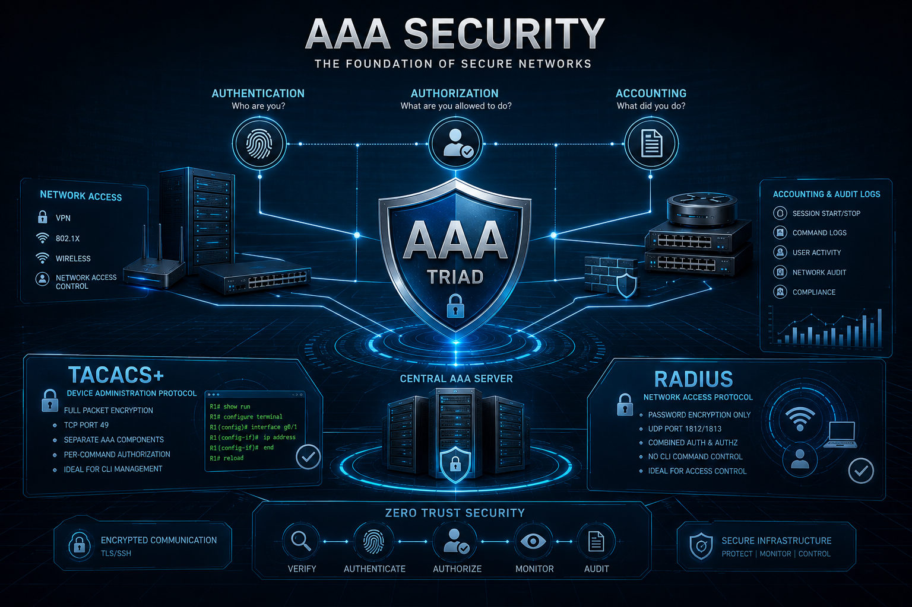

Wenn wir über Netzwerksicherheit sprechen, denken wir oft sofort an komplexe Firewalls, Verschlüsselungsalgorithmen oder riesige Zugriffskontrolllisten (ACLs). Aber im eigentlichen Kern jedes sicheren Netzwerks liegt ein fundamentales Trio, das das Rückgrat der Infrastruktursicherheit bildet: **AAA (Authentication, Authorization, and Accounting)**.

Aber was genau ist AAA? Bevor wir uns im technischen Jargon verlieren, betrachten wir dies nicht als trockenes Engineering-Dokument, sondern anhand eines realen Szenarios, das wir alle kennen: **der Check-in in einem Hochsicherheitshotel**.

---

### 🔑 Die Hotel-Analogie und ihr technischer Hintergrund

#### 1. Authentication (Authentifizierung): "Wer bist du?"
Sie gehen zur Rezeption des Hotels. Bevor der Mitarbeiter Ihnen einen Zimmerschlüssel aushändigt, worum bittet er Sie zuerst? Um Ihren Ausweis oder Reisepass. Das Ziel hierbei ist es, zu überprüfen, ob die Person, die vor ihnen steht, auch tatsächlich diejenige ist, die die Reservierung vorgenommen hat.
* **Ein Blick hinter die Kulissen:** Dies entspricht der Abfrage von Benutzername und Passwort, wenn ein Ingenieur versucht, sich per SSH auf einem Router oder Switch anzumelden. Das Netzwerk fragt: *Sind diese Anmeldedaten gültig? Ist diese Person wirklich die, die sie vorgibt zu sein?* In kleinen Netzwerken befinden sich diese Daten direkt in der lokalen Datenbank (`local database`) des Geräts. In Unternehmensumgebungen leitet AAA diese Anfrage jedoch an einen zentralen Server wie Cisco ISE oder Aruba ClearPass weiter.

#### 2. Authorization (Autorisierung): "Was darfst du hier tun?"
Ihr Ausweis wurde überprüft und der Mitarbeiter händigt Ihnen eine digitale Schlüsselkarte aus. Diese Karte öffnet jedoch nicht jede Tür im Gebäude. Sie können Ihr Zimmer oder den Fitnessbereich betreten, aber wenn Sie die Karte an der Penthouse-Suite oder dem Hauptserverraum einlesen, bleibt die Tür verschlossen.
* **Ein Blick hinter die Kulissen:** Ein erfolgreicher Login auf einem Gerät bedeutet nicht, dass Sie das Recht haben, alles zu ändern. Im Cisco-Ökosystem gibt es Standard-Berechtigungsstufen (`privilege levels`) von 0 bis 15. Dank AAA können wir eine **rollenbasierte Zugriffskontrolle (RBAC)** implementieren. Ein Junior-Praktikant ist beispielsweise nur berechtigt, Überwachungsbefehle (`show`) auszuführen, während ein Senior-Ingenieur dynamisch die vollen Konfigurationsrechte (`config t`) erhält.

#### 3. Accounting (Protokollierung / Rechenschaftspflicht): "Was hast du tatsächlich getan?"
Es ist Zeit für den Check-out. Die Rezeption händigt Ihnen eine detaillierte Abrechnung aus: Was wurde um 21:00 Uhr aus der Minibar genommen, welcher Film wurde um Mitternacht gesehen... Das Hotelmanagement hat jeden Ihrer Schritte aus Sicherheits- und Abrechnungsgründen protokoliert.
* **Ein Blick hinter die Kulissen:** In der Netzwerktechnik ist dies der ultimative digitale Fußabdruck. Wenn eine Sitzung geöffnet wird, wird ein `Start`-Paket an den zentralen AAA-Server gesendet, gefolgt von einem `Stop`-Paket, wenn sie geschlossen wird. Wenn ein Core-Switch plötzlich abstürzt, werden die Protokolle überprüft, um genau festzustellen, wer den Befehl `reload` wann ausgeführt hat. Es geht nicht darum, Schuldige zu suchen, sondern um Netzwerk-Auditierung und Transparenz.

---

### ⚔️ Der Protokollkrieg: TACACS+ vs. RADIUS

Da wir das Konzept nun verstanden haben, sprechen wir über die Praxis. In der Realität verbinden wir unsere Netzwerkgeräte über zwei Hauptprotokolle mit einem zentralen Sicherheitsserver. Die Wahl zwischen ihnen hängt ganz davon ab, was wir schützen wollen.

| Feature | TACACS+ (Der Gerätemanager) | RADIUS (Der Torwächter) |
| :--- | :--- | :--- |
| **Primäre Nutzung** | Geräteadministration (Router/Switch-Management) | Netzwerzugangssicherheit (VPN-Benutzer, 802.1X Wi-Fi) |
| **Verschlüsselung** | **Verschlüsselt das gesamte Paket** | Verschlüsselt **nur** das Passwort-Feld |
| **Protokolltyp** | Nutzt TCP (Port 49) - Zuverlässige Verbindung | Nutzt UDP (Port 1812/1813) - Schneller, leichtgewichtig |
| **Architektur** | Trennt AAA-Komponenten vollständig | Kombiniert Authentifizierung & Autorisierung |
| **Befehlskontrolle** | Autorisierung pro Befehl (Essenziell für CLI) | Keine granulare CLI-Befehlskontrolle |

#### Warum ich TACACS+ für das Infrastrukturmanagement bevorzuge
Bei der Verwaltung von Unternehmensroutern und -switches ist **TACACS+** mein klarer Favorit. Die Verschlüsselung des gesamten Pakets verhindert, dass unsere Topologie und Befehlsdetails im Netzwerk mitgelesen werden können. Da es zudem die Autorisierung von der Authentifizierung trennt, können wir jedes Mal, wenn un Ingenieur die Eingabetaste bei einem CLI-Befehl drückt, den Server in Echtzeit abfragen: *"Darf dieser Benutzer diesen spezifischen Befehl jetzt ausführen?"* RADIUS kann diese granulare Kontrolle architektonisch nicht so effizient bereitstellen.

---

### 🚀 AAA in der modernen Ära: Die Verbindung mit Zero Trust

In traditionellen Designs wurde AAA meist verwendet, um Ingenieure zu überwachen, die auf interne Geräte zugreifen. In den heutigen **Zero-Trust**-Architekturen ist der Netzwerkperimeter jedoch verschwunden. Die Philosophie "Ich bin im Firmennetzwerk, also bin ich sicher" ist offiziell tot.

Betrachten wir eine weitere wichtige Implementierung: **Site-to-Site IPsec VPN**-Architekturen. Während sichere verschlüsselte Tunnel verhindern, dass Daten während der Übertragung abgefangen werden, wie stellen wir sicher, dass die Person, die diesen Tunnel von der anderen Seite aus initiiert, wirklich autorisiert ist?

Hier glänzt AAA in modernen Umgebungen:
1. Wenn ein Remote- oder Branch-Benutzer Zugriff über das VPN anfordert, fängt das Gateway die Anfrage ab.
2. Die Anmeldedaten werden sofort über RADIUS an den zentralen AAA-Server weitergeleitet.
3. Der Server prüft den Kontext: *Verfügt das Gerät über das richtige Unternehmenszertifikat? Ist der Antivirensschutz aktuell?* (Context-Aware Authentication).
4. Wenn alles stimmt, erhält der Benutzer nur auf das minimale Netzwerksegment Zugriff (`Authorization`), das für seine Arbeit erforderlich ist.

Letztendlich ist AAA kein altmodisches Werkzeug mehr, um nur Router zu verwalten; es ist eine unverzichtbare Sicherheitsdisziplin, die im Herzen moderner Cybersicherheit, VPN-Infrastrukturen und Identity & Access Management (IAM) Systeme sitzt.