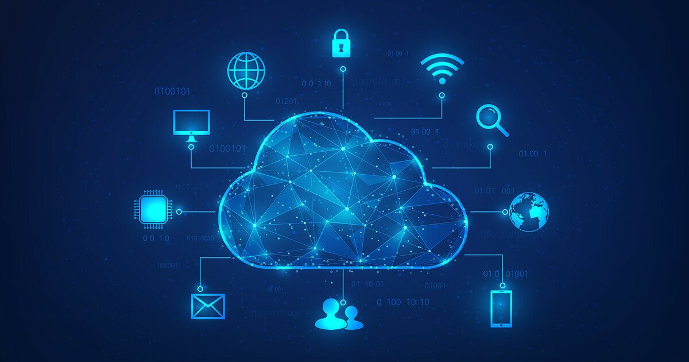

In today's software and infrastructure world, "Cloud" is no longer just a trendy buzzword — it has become the backbone of modern IT infrastructure and enterprise systems. While Cloud is often described in popular culture, somewhat superficially, as "renting someone else's computers," once you get down to the infrastructure, networking, and engineering level, it represents a far more complex and powerful architecture.

In this guide, we'll take a deep dive into the logic behind the transition from traditional On-Premise setups to modern Cloud architectures, service and deployment models, cloud network design (SDN/VPC) from an infrastructure engineer's perspective, high-availability (HA) principles, and the security rules you can't afford to overlook.

---

## 1. The Transition from On-Premise to the Cloud

In traditional **On-Premise** (local data center) architectures, setting up a system requires serious physical operations and process management: physical server procurement, cabling, climate control, uninterruptible power supplies (UPS), rack cabinet layout, and networking hardware (switches, routers, firewalls).

The biggest constraints of this traditional approach are:

* **CapEx (Capital Expenditure) Burden:** High upfront setup costs. Massive hardware investments have to be made before a project's actual traffic load and success are even known.
* **The Capacity Planning Dilemma:** During sudden traffic spikes, systems can become overwhelmed and crash (**under-provisioning**); or, when hardware is purchased with peak traffic in mind, 80% of that capacity sits idle on normal days (**over-provisioning**).
* **Lack of Agility:** Ordering a new server, having it delivered to the data center, mounting it, and configuring it can take weeks or even months.

**Cloud Computing** turns hardware from a physical asset into a **utility** and a **software object**. Much like an electricity or water grid: you provision exactly the resources you need instantly, pay only for what you use (**pay-as-you-go**), and destroy the resource with a single API call once you're done with it.

---

## 2. Cloud Service Models (XaaS)

Cloud services fall into three main categories, based on the level of abstraction offered to the user and where management responsibility sits:

| Service Model | Your Responsibility | Cloud Provider's Responsibility |
| :--- | :--- | :--- |
| **SaaS** | Data and Usage Only | Application, Runtime, OS, Hardware |
| **PaaS** | Application and Data | Runtime, Operating System, Virtualization, Hardware |
| **IaaS** | OS, Application, Network Configuration | Virtualization, Hardware, Data Center |

### 🏢 IaaS (Infrastructure as a Service)
This is the most fundamental level of infrastructure. The hardware and virtualization layer is managed by the cloud provider (AWS, Azure, GCP); the virtual server (VM), disk storage, operating system choice, and detailed network configuration are entirely under your control.
* **Use Case:** Moving existing On-Premise systems to the cloud as-is (Lift-and-Shift), or infrastructure that requires full control.
* **Examples:** AWS EC2, Azure VMs, Google Compute Engine.

### 🛠️ PaaS (Platform as a Service)
Operating system updates, security patches, runtime management (Node.js, Python, Java, etc.), and database engine management are left to the cloud provider. The developer simply writes code and ships it to the environment.
* **Use Case:** Software teams who want to get a product or application live quickly without spending time on server management.
* **Examples:** AWS Elastic Beanstalk, Heroku, Google App Engine, Azure App Service.

### 📦 SaaS (Software as a Service)
Fully managed, ready-to-use software aimed at end users, accessed via a web browser or API. Requires no coding or hardware management whatsoever.
* **Examples:** Google Workspace, Microsoft 365, Salesforce, Jira.

---

## 3. Cloud Deployment Models

* **Public Cloud:** A model where resources are offered to everyone over the public internet by third-party providers (AWS, Azure, GCP). Provides high scalability.
* **Private Cloud:** A cloud infrastructure dedicated to a single organization, running either in an in-house data center (On-Premise) or on isolated private servers (OpenStack, VMware Cloud Foundation).
* **Hybrid Cloud:** A model where On-Premise infrastructure is securely connected to the Public Cloud and the two operate together. This is the preferred choice for organizations — such as those in finance, healthcare, and banking — that handle sensitive data but still want to take advantage of the flexibility of the Public Cloud.
* **Multi-Cloud:** An architecture where two or more public cloud providers (e.g. AWS + Google Cloud) are used simultaneously, reducing dependency on a single vendor (**vendor lock-in**) and combining the best services from each.

---

## 4. An Engineering Perspective: Cloud and Software-Defined Networking (SDN)

A common misconception is that the Cloud is nothing more than virtual servers. In reality, **no cloud architecture can operate securely without a solid, properly isolated network design.** Concepts from the physical world — VLANs, subnets, routing tables, NAT, and firewalls — turn into codifiable structures in the Cloud through **Software-Defined Networking (SDN)**.

### Virtual Private Cloud (VPC) Design
A VPC is a logically isolated virtual network environment within the Public Cloud, allocated exclusively to your organization.

1. **Subnet Hierarchy:**
   * **Public Subnet:** The network segment connected directly to the Internet Gateway (IGW), where components that need to be reachable from the outside world (load balancers, bastion hosts, etc.) are placed.
   * **Private Subnet:** A segment that cannot be reached directly from the internet, is only accessible from the internal network, and reaches the internet through a NAT Gateway (application servers, microservices).
   * **Database Subnet:** A fully isolated segment with no internet access whatsoever, which only responds to requests coming from the Private Subnet.

2. **Security Layers (Defense in Depth):**
   * **Security Group (SG):** A **stateful** firewall operating at the virtual server (ENI) level. Once inbound traffic is allowed, the corresponding return traffic is automatically permitted.
   * **Network ACL (NACL):** A **stateless** security layer operating at the subnet level. Both inbound and outbound rules must be explicitly defined.

```text
[ Internet ]
     ↓
[ Internet Gateway ]
     ↓
[ Public Subnet ]    ──> (Load Balancer / Security Group)
     ↓
[ NAT Gateway ]
     ↓
[ Private Subnet ]   ──> (App Servers / Security Group)
     ↓
[ Database Subnet ]  ──> (Isolated Database Cluster)
```

### Methods for Connecting On-Premise to the Cloud
In hybrid architectures, two main methods are used to connect your local data center with your cloud VPC:
* **Site-to-Site IPsec VPN:** An encrypted tunnel established over the internet — fast to set up and cost-effective.
* **Dedicated Direct Connection (AWS Direct Connect / Azure ExpressRoute):** A fixed-line, high-speed (1Gbps–100Gbps), low-latency physical fiber connection between the customer's data center and the cloud provider's PoP, completely bypassing the public internet.

---

## 5. High Availability and Elasticity

Two fundamental engineering principles set cloud architecture apart from traditional setups:

### 🔄 Auto Scaling & Elasticity
Increasing a server's processing power (CPU) or memory (RAM) capacity as traffic grows is called **Vertical Scaling (Scale Up)**, while adding new server instances with the same specifications is called **Horizontal Scaling (Scale Out)**.

Thanks to the **Auto Scaling Group (ASG)** structure in the cloud, the architecture can, for example, automatically spin up new EC2/VM instances once CPU usage exceeds 70%, and shut them down again when traffic drops.

### 🌐 Multi-AZ and Multi-Region Architecture
* **Availability Zone (AZ):** Physically separate data centers within a region, each with independent power, cooling, and network infrastructure.
* **High Availability (HA):** To keep a system running uninterrupted if a server goes down, applications are deployed across subnets spread over at least two different AZs, fronted by an **Application Load Balancer (ALB)**.

---

## 6. Security and the Shared Responsibility Model

The biggest strategic mistake in cloud security is the mindset of "We moved everything to the cloud, so security is their problem now." Giants like AWS and Azure operate on the **Shared Responsibility Model**:

* **Security OF the Cloud (Provider's Responsibility):** Physical data center security, hardware failures, the hypervisor layer, physical network cabling, and infrastructure facility security.
* **Security IN the Cloud (Customer's Responsibility):** Operating system updates on the virtual server, IAM (Identity and Access Management) user permissions, firewall rules, data encryption (at rest and in transit), and application code security.

---

## 7. Infrastructure as Code (IaC) and FinOps

In modern cloud management, manually creating servers or networks by clicking through a console ("ClickOps") is neither sustainable nor free of human error.

### Infrastructure as Code (IaC)
This means defining your entire infrastructure (VPC, subnets, EC2, load balancers, etc.) through code files.
* **Terraform / OpenTofu:** With its declarative language, it lets you manage infrastructure as code across all cloud providers.
* **Advantages:** Version control (tracked via Git), repeatability (spinning up the same infrastructure in a test environment within seconds), and easier disaster recovery.

### FinOps and Cost Management
While the Cloud provides flexibility, it can also lead to runaway budgets. **FinOps** is the practice of engineering and finance teams working together to optimize costs by:
* Identifying and removing unused, idle resources.
* Using **Reserved Instances (RI)** or **Savings Plans** for stable workloads running 24/7, achieving discounts of 60–70%.
* Using **Spot Instances** for temporary jobs.

---

## 8. Conclusion and Future Outlook

Cloud Computing has completely freed infrastructure engineering from its dependence on physical hardware, ushering in the era of **Software-Defined Infrastructure (SDN & IaC)**. Today, the roles of network engineering, systems administration, and software development are converging under the disciplines of **DevOps, SRE (Site Reliability Engineering), and Cloud Engineering**.

For an engineer looking to enter this field, the most critical step is blending networking fundamentals (TCP/IP, routing, DNS), virtualization/container technologies (Docker, Kubernetes), and Infrastructure as Code tools (Terraform) with cloud principles.

Rather than staying purely theoretical, opening a free-tier account on **AWS** or **Azure** — the market leaders — and building hands-on projects is the fastest way to master this ecosystem.
