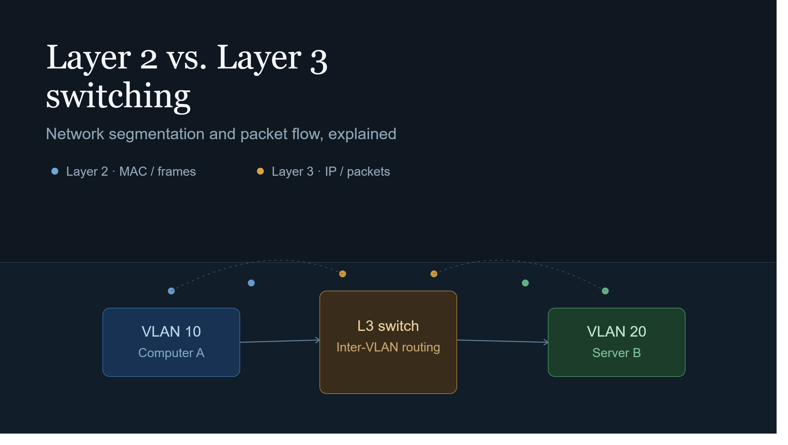

Bir bilgisayar ağının tasarımında karşılaşılan en temel mimari kararlardan biri, trafiğin ne kadarının Katman 2 (Data Link) seviyesinde tutulacağı ve ne zaman Katman 3 (Network) seviyesine taşınacağıdır. Yeni başlayanlar veya altyapı mimarisini inceleyenler için şu soru sıklıkla kafa karıştırır: Cihazlar aynı bina içinde veya aynı switch üzerinde bulunuyorsa, neden her şeyi tek bir düz Katman 2 ağında bırakmıyoruz? Neden VLAN'lar oluşturup araya Katman 3 anahtarlama ve yönlendirme katmanları ekliyoruz?

Bu yazıda, düz bir Katman 2 ağının donanımsal ve mantıksal limitlerini, Katman 3 anahtarlamanın (L3 Switching) nasıl çalıştığını ve bir paketin iki katman arasında geçerken yaşadığı dönüşümü mühendislik perspektifinden ele alıyoruz.

---

## 1. Tek Bir Katman 2 Ağında Kalmanın Limitleri: Broadcast ve Donanım Yükü

Bir ağdaki tüm cihazlar aynı Katman 2 alanında (Broadcast Domain) bulunduğunda, bir cihazın gönderdiği her yayılım (broadcast) paketi —örneğin ARP istekleri veya DHCP keşif paketleri— ağdaki diğer tüm cihazlara ulaşır.

Ölçeksiz büyüyen bir Katman 2 ağında iki temel sorun ortaya çıkar:

* **Broadcast Fırtınaları ve CPU Yükü:** Ağdaki cihaz sayısı arttıkça yayın paketlerinin sayısı katlanarak artar. Ağ kartları bu paketleri işlemek zorunda kaldığı için son kullanıcı cihazlarında ve switch'lerde işlemci yükü yükselir.
* **MAC Adres Tablosu (CAM Table) Şişmesi:** L2 switch'ler paket iletimini MAC adres tablolarına göre yapar. Ağ büyüdükçe bu tabloların kapasitesi zorlanır ve donanımsal arama süreleri uzar.

Bu sınırları aşmanın yolu, ağı mantıksal parçalara yani VLAN'lara bölmektir. Ancak VLAN'lar oluşturulduğunda, bu farklı segmentlerin birbiriyle nasıl haberleşeceği sorusu ortaya çıkar.

---

## 2. Katman 2 vs. Katman 3 Anahtarlama Mantığı

Katman 2 anahtarlamada işlem tamamen MAC adresleri ve Ethernet Frame'leri üzerinden yürür. Cihazlar aynı subnet içindeyse, kaynak cihaz hedef cihazın MAC adresini ARP ile öğrenir ve switch bu iletimi donanımsal olarak (ASIC çiplerini kullanarak) hat hızında yapabilir.

Katman 3 anahtarlamada ise süreç IP adresleri ve paketler üzerinden yürür. Farklı VLAN'lardaki veya subnet'lerdeki cihazlar haberleşmek istediğinde, Katman 2 anahtarlama tek başına yetersiz kalır. Burada devreye Switched Virtual Interface (SVI) ve IP Routing mekanizmaları girer.

---

## 3. Klasik Router ve L3 Switch Arasındaki Çizgi

Zaten bir Router varsa, neden Katman 3 Switch (L3 Switch) kullanıyoruz? Ya da tam tersi, L3 Switch varsa Router'a neden ihtiyaç duyuyoruz?

İki cihaz da IP routing yapabilse de, mimari ve donanım tasarımları farklı amaçlara hizmet eder:

* **L3 Switch (Inter-VLAN Routing):** Yönlendirme kararını yazılımsal CPU yerine doğrudan donanımsal ASIC veya CEF (Cisco Express Forwarding) tabloları üzerinden yapar. Bu sayede local ağdaki VLAN'lar arası trafiği gigabit/terabit seviyelerindeki hat hızlarında (wire-speed) çok düşük gecikmeyle yönlendirir.
* **Router (Edge / WAN Sınırı):** Genellikle daha karmaşık yönlendirme protokollerini (BGP vb.), geniş alan ağı (WAN) teknolojilerini, NAT (Network Address Translation) işlemlerini, derinlemesine güvenlik ve VPN tünelleme süreçlerini yürütmek için tasarlanmıştır. Port yoğunlukları L3 Switch'e göre daha düşüktür ancak paket işleme yetenekleri daha esnektir.

Özetle; bina veya veri merkezi içindeki VLAN'lar arası yüksek hızlı yönlendirmeyi L3 Switch üstlenirken, dış dünyaya veya farklı lokasyonlara çıkış sınırını Router yönetir.

---

## 4. Ağ Segmentasyonu: Güvenlik ve Performans Dengesi

Katman 3 anahtarlamanın getirdiği en büyük avantaj ağ segmentasyonudur. Ağ küçük yayın alanlarına bölündüğünde sadece performans kazanılmaz; aynı zamanda güvenlik sınırları da çizilmiş olur.

Farklı VLAN'lar arasına koyulan L3 Switch veya Firewall katmanlarında Erişim Kontrol Listeleri (ACL - Access Control List) tanımlanarak, örneğin "İnsan Kaynakları VLAN'ı Sunucu VLAN'ındaki sadece belirli servislere erişebilsin, IoT cihazları ise hiçbir iç ağa erişemesin" gibi kurallar mantıksal olarak uygulanabilir hale gelir.

---

## 5. Paket Akış Analizi: Bir Paket Katman Değiştirirken Ne Olur?

Mimarinin tam anlaşılması için bir paketin izlediği yolu adım adım takip etmek gerekir. Örneğin, VLAN 10'daki Bilgisayar A, VLAN 20'deki Sunucu B'ye bir veri paketi göndermek istediğinde gerçekleşen olaylar şunlardır:

1. **Subnet Kontrolü:** Bilgisayar A, kendi IP adresi ve subnet mask'ı ile hedef Sunucu B'nin IP adresini karşılaştırır. Farklı bir ağda olduğunu anlar.
2. **Default Gateway'e Gönderim:** Paket doğrudan Sunucu B'nin MAC adresine değil, kendi Varsayılan Ağ Geçidinin (Default Gateway - L3 Switch üzerindeki SVI arabirimi) MAC adresine yönlendirilir.
3. **L2 Header Değişimi:** L3 Switch paketi aldığında IP başlığındaki (L3) Kaynak ve Hedef IP adreslerini ASLA değiştirmez (TTL değeri 1 azaltılır). Ancak paket L3 Switch'ten çıkıp VLAN 20'deki Sunucu B'ye doğru iletilirken, Ethernet Başlığı (L2 Frame Header) yeniden yazılır. Kaynak MAC adresi artık L3 Switch'in VLAN 20 arabirimi, Hedef MAC adresi ise Sunucu B'nin MAC adresi olur.
4. **Teslimat:** Paket VLAN 20 seviyesinde L2 olarak Sunucu B'ye ulaştırılır.

---

## Sonuç

Katman 2 ve Katman 3 teknolojilerini birbirinin rakibi değil, bir mimarinin tamamlayıcı parçaları olarak görmek gerekir. Anahtarlama (Switching) trafiği yerel düzeyde ve donanım hızında tutarken; Yönlendirme (Routing) bu yerel alanları kontrol edilebilir, güvenli ve ölçeklenebilir yapılara dönüştürür. İyi tasarlanmış bir ağ mimarisinde L2 sınırları olabildiğince dar tutulur ve trafik en kısa sürede L3 seviyesine çekilerek yönetilir.
