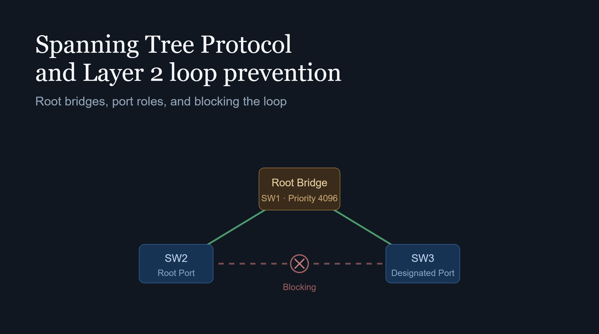

## Giriş

Katman 2 (Data Link) ağlarda yedeklilik (redundancy) sağlamak için fiziksel olarak birden fazla kablo veya switch bağlantısı kurmak şarttır. Ancak IP başlığındaki gibi bir TTL (Time to Live) alanı Ethernet başlığında bulunmaz. Bu durum, yedekli bir Katman 2 ağında döngü (loop) oluştuğunda broadcast paketlerinin sonsuza kadar dönmesine, MAC adres tablolarının bozulmasına ve tüm ağın kilitlenmesine (Broadcast Storm) yol açar.

STP (IEEE 802.1D) ve onun daha hızlı versiyonu olan RSTP (IEEE 802.1w), ağdaki fiziksel döngüleri tespit ederek mantıksal olarak belirli portları engelleme (blocking) durumuna getirir.

---

## 1. Root Bridge Seçim Mekanizması

STP topolojisinin merkezinde bir **Root Bridge** bulunur. Ağdaki tüm switch'ler birbirlerine **BPDU (Bridge Protocol Data Unit)** paketleri göndererek Root Bridge'i seçer.

Seçim kriteri en düşük **Bridge ID (BID)** değerine sahip switch'tir. BID, sanıldığının aksine sadece iki değil, üç bileşenden oluşur:

```
Bridge ID = Priority + Extended System ID (VLAN ID) + MAC Adresi
```

* **Priority:** Varsayılan değeri **32768**'dir, 4096'lık artışlarla manuel olarak ayarlanabilir.
* **Extended System ID:** PVST+ ortamında her VLAN'a ait ayrı bir STP instance'ı çalıştığı için, bu alan gönderilen BPDU'nun hangi VLAN'a ait olduğunu belirtir ve Priority değerine dahil edilir.
* **MAC Adresi:** Öncelik değerleri eşitse, en düşük MAC adresine sahip switch Root Bridge olur.

İdeal bir ağ tasarımında Root Bridge seçimi şansa bırakılmaz; omurga (core) switch'lerin öncelik değeri manuel olarak düşürülür (örneğin **4096** veya **8192**), ikincil bir Root Bridge adayı için ise bir kademe üstü değer (örneğin **8192** veya **16384**) atanır.

---

## 2. Port Rolleri, Durumları ve Path Cost

Root Bridge seçildikten sonra ağdaki her switch portuna belirli roller atanır:

* **Root Port (RP):** Root Bridge dışındaki her switch'in Root Bridge'e en kısa/en ucuz yoldan ulaşan portudur (switch başına 1 adet).
* **Designated Port (DP):** Belirli bir ağ segmentinde trafiği iletmekten sorumlu porttur. Root Bridge üzerindeki tüm aktif portlar varsayılan olarak DP'dir.
* **Alternate / Backup Port (AP/BP):** Döngü oluşturmaması için trafik iletimine kapatılan (Blocking/Discarding) yedek portlardır.

"En ucuz yol" ifadesi soyut değildir; STP bunu **Path Cost** değerleriyle sayısal olarak hesaplar. IEEE 802.1D'nin güncellenen (kısa) maliyet tablosu şöyledir:

| Bağlantı Hızı | Path Cost (STP kısa değer) |
| :--- | :--- |
| 10 Mbps | 100 |
| 100 Mbps | 19 |
| 1 Gbps | 4 |
| 10 Gbps | 2 |

Bir switch, Root Bridge'e giden her olası yolun toplam maliyetini (o yol üzerindeki tüm portların cost değerlerinin toplamı) hesaplar ve en düşük toplam maliyete sahip portu Root Port olarak seçer.

---

## 3. 802.1D STP vs. 802.1w RSTP Port Durumları

Klasik STP'de bir portun aktif hale geçmesi (Forwarding) 30 ila 50 saniye sürebilir. RSTP ise **Proposal/Agreement** el sıkışma (handshake) mekanizmasıyla bu süreyi milisaniyelere indirir.

| 802.1D STP Durumu | 802.1w RSTP Durumu | MAC Öğrenme | Trafik İletimi |
| :--- | :--- | :---: | :---: |
| Disabled | Discarding | Hayır | Hayır |
| Blocking | Discarding | Hayır | Hayır |
| Listening | Discarding | Hayır | Hayır |
| Learning | Learning | Evet | Hayır |
| Forwarding | Forwarding | Evet | Evet |

RSTP, port rollerine de iki yeni kavram ekler: **Edge Port** (PortFast'e denk gelir, doğrudan son kullanıcı cihazına bağlı port) ve **Alternate/Backup portların önceden hesaplanması** — bir bağlantı koptuğunda RSTP, alternatif yolu STP gibi sıfırdan aramaz, zaten önceden belirlenmiş yedek portu anında devreye alır.

---

## 4. STP Zamanlayıcıları: 30-50 Saniyenin Kaynağı

Klasik STP'nin yavaşlığının nedeni rastgele değildir; üç zamanlayıcının toplamından gelir:

* **Hello Timer (2 sn):** Root Bridge her 2 saniyede bir BPDU yayınlar.
* **Max Age (20 sn):** Bir switch, komşusundan 20 saniye boyunca BPDU alamazsa topolojinin değiştiğini varsayar.
* **Forward Delay (15 sn × 2):** Bir port, Listening ve Learning durumlarının her birinde 15'er saniye bekler.

Toplamda: **Max Age (20 sn) + 2 × Forward Delay (2 × 15 sn) = 50 saniye** en kötü senaryo yakınsama süresidir. Doğrudan komşu kaybı gibi daha iyi senaryolarda bu süre ~30 saniyeye iner.

RSTP bu bekleme mantığını tamamen terk eder: komşu switch'ler arasında **Proposal/Agreement** el sıkışması yapılır, her switch komşusunun senkron olduğunu doğrular doğrulamaz portu doğrudan Forwarding durumuna geçirir. Sonuç, çoğu topolojide 1 saniyenin altında yakınsama süresidir.

---

## 5. Yakınsama Senaryosu: Bir Bağlantı Koptuğunda Ne Olur?

Üç switch'ten oluşan bir üçgen topolojiyi (SW1 = Root Bridge, SW2 ve SW3 birbirine ve Root'a bağlı) ele alalım. SW2-SW3 arasındaki link Alternate/Blocking durumdaydı.

1. **Link Kaybı Tespiti:** SW1-SW2 arasındaki fiziksel bağlantı koparsa, SW2 doğrudan bunu algılar (fiziksel link-down sinyali).
2. **Topology Change Notification (TCN):** SW2, RSTP'de doğrudan bir Topology Change BPDU'sunu Root Bridge yönünde (veya STP'de klasik TCN BPDU zincirini) yayınlar.
3. **MAC Tablosu Flush:** Topoloji değişikliği bilgisini alan tüm switch'ler, MAC adres tablolarındaki eski yolları geçersiz kılar (STP'de Forward Delay süresiyle, RSTP'de anında).
4. **Yeniden Hesaplama:** SW2, artık Root Bridge'e SW3 üzerinden ulaşabileceğini fark eder; SW2-SW3 arasındaki Alternate Port, Root Port'a terfi eder.
5. **Yeni Yolun Aktifleşmesi:** RSTP'de bu port, önceden zaten "hazır" (pre-computed) olduğu için milisaniyeler içinde Forwarding'e geçer. Klasik STP'de ise bu port Blocking → Listening → Learning → Forwarding aşamalarından tekrar geçmek zorunda kalır ve tam 30-50 saniyelik gecikme burada yaşanır.

---

## 6. PVST+, Rapid PVST+ ve MST

Yukarıdaki anlatım tek bir STP örneğini varsayar, ancak gerçek Cisco ortamlarında üç farklı çalışma modu bulunur:

* **PVST+ (Per-VLAN Spanning Tree Plus):** Her VLAN için ayrı, bağımsız bir STP instance'ı çalıştırır. Bu, VLAN başına farklı bir Root Bridge seçilebilmesine ve dolayısıyla trafiğin farklı linkler üzerinde load-balance edilmesine olanak tanır — örneğin VLAN 10 SW1'i, VLAN 20 SW2'yi Root Bridge olarak kullanabilir.
* **Rapid PVST+ (RPVST+):** PVST+'ın RSTP mantığıyla çalışan hızlı sürümüdür; Cisco'nun günümüzde varsayılan olarak önerdiği moddur.
* **MST (Multiple Spanning Tree — IEEE 802.1s):** Yüzlerce VLAN'ın olduğu büyük ortamlarda her VLAN için ayrı instance çalıştırmak CPU açısından maliyetlidir. MST, birden fazla VLAN'ı tek bir STP "instance"ında (region) gruplayarak bu yükü azaltır.

---

## 7. L2 Ağ Güvenliği ve Port Koruma Mekanizmaları

STP sadece döngü engellemekle kalmaz, doğru konfigürasyon yapılmadığında güvenlik zafiyeti de yaratabilir. Kötü niyetli bir cihaz ağa düşük Priority içeren BPDU'lar göndererek kendini Root Bridge ilan edebilir. Bunun önüne geçmek için şu koruma mekanizmaları kullanılır:

* **PortFast:** Sunucu veya PC gibi son kullanıcı cihazlarının bağlı olduğu portlarda Listening/Learning aşamalarını atlayarak portun anında Forwarding durumuna geçmesini sağlar.
* **BPDU Guard:** PortFast tanımlı bir porta dışarıdan bir BPDU paketi gelirse (örneğin kullanıcı izinsiz bir switch bağlarsa), portu anında **err-disable** moduna alarak ağı korur.
* **Root Guard:** Yetkisiz bir switch'in ağın Root Bridge'i olmasını engeller. Eğer tanımlı porttan daha iyi bir BPDU gelirse, o portu **root-inconsistent** durumuna getirip trafiği keser.
* **Loop Guard:** Fiziksel bir hat hatası (tek yönlü bağlantı kaybı) durumunda Alternate portun yanlışlıkla Forwarding durumuna geçip döngü yaratmasını engeller.

RSTP öncesinde, klasik STP'nin 30-50 saniyelik yakınsama süresini kısaltmak için Cisco'nun geliştirdiği iki tarihsel özellik de bu ailenin bir parçasıdır: **UplinkFast** (bir switch'in doğrudan komşu linkini kaybettiğinde, yedek uplink'e Forward Delay beklemeden geçmesini sağlar) ve **BackboneFast** (dolaylı bir link kaybını Max Age süresini beklemeden tespit eder). RSTP'nin yaygınlaşmasıyla bu iki özellik büyük ölçüde gereksiz hale gelmiştir, çünkü RSTP aynı hızlı yakınsamayı standart olarak sağlar.

---

## 8. EtherChannel ile İlişkisi

Fiziksel olarak birden fazla kabloyla bağlanan iki switch, STP açısından bir döngü riski taşır ve bu linklerden biri Blocking durumuna düşürülür. **EtherChannel (Port Channel)**, bu fiziksel bağlantıları tek bir mantıksal arayüzde birleştirir. STP, bir port-channel'ı tek bir port olarak görür; dolayısıyla hem döngü oluşmaz hem de bağlı tüm fiziksel linkler aynı anda (load-balanced şekilde) aktif kalır. Bu, "STP'yi devre dışı bırakmadan" bant genişliğini artırmanın standart yoludur.

---

## 9. Temel CLI Konfigürasyon Örneği

Cisco IOS üzerinde yukarıda anlatılan mekanizmaların pratikteki karşılığı aşağı yukarı şu komutlardır:

```
! Root Bridge önceliğini manuel olarak düşürme (core switch üzerinde)
Switch(config)# spanning-tree vlan 10 priority 4096

! Rapid PVST+ modunu etkinleştirme
Switch(config)# spanning-tree mode rapid-pvst

! Son kullanıcı portunda PortFast + BPDU Guard
Switch(config)# interface fastEthernet 0/1
Switch(config-if)# spanning-tree portfast
Switch(config-if)# spanning-tree bpduguard enable

! Root Guard'ı bir uplink portunda etkinleştirme
Switch(config)# interface gigabitEthernet 0/1
Switch(config-if)# spanning-tree guard root

! Loop Guard'ı global olarak etkinleştirme
Switch(config)# spanning-tree loopguard default
```

---

## 10. Modern Data Center'da STP'nin Yerini Ne Alıyor?

Geleneksel üç katmanlı (access-distribution-core) kampüs ağlarında STP hâlâ standarttır. Ancak modern **spine-leaf** data center mimarilerinde STP'nin doğası gereği yarattığı bir sorun var: aktif-pasif tasarımı gereği, yedekli linklerin bir kısmını sürekli Blocking durumunda tutar — bu da mevcut bant genişliğinin önemli bir kısmının kullanılamaması demektir.

Bu nedenle büyük ölçekli data center'lar STP'yi büyük ölçüde devre dışı bırakan veya sınırlayan mimarilere yönelmiştir:

* **vPC (Virtual Port Channel) / MC-LAG:** İki fiziksel switch'i mantıksal olarak tek bir switch gibi göstererek, aralarındaki linklerin STP tarafından bloklanmasını önler; tüm linkler aktif-aktif çalışır.
* **VXLAN / EVPN:** Katman 2 segmentleri, fiziksel topolojiden bağımsız olarak bir Katman 3 IP fabric üzerinden "tünellenir". Bu sayede spine-leaf fabric'in kendisi saf Katman 3 (ECMP ile tüm linkler aktif) olarak çalışır ve STP'ye ihtiyaç fabric içinde ortadan kalkar; STP yalnızca en dış kenarda (edge) son kullanıcı bağlantılarının olduğu segmentlerde bir güvenlik ağı olarak kalmaya devam eder.

---

## Sonuç

STP, Katman 2 ağların en temel ama en kritik güvenlik ve stabilite katmanlarından biridir. Root Bridge seçiminden Path Cost hesaplamasına, zamanlayıcılardan port koruma mekanizmalarına kadar her bileşen, "hiçbir broadcast paketinin sonsuza kadar dönmemesi" gibi tek bir amaca hizmet eder. RSTP ve MST bu temel mantığı korurken hızı ve ölçeklenebilirliği artırır; modern data center mimarileri ise STP'yi ortadan kaldırmak yerine, onu yalnızca gerçekten gerekli olduğu yerde (kenar bağlantılarda) bırakıp merkezde tamamen Katman 3 tabanlı, aktif-aktif tasarımlara geçmeyi tercih eder.
