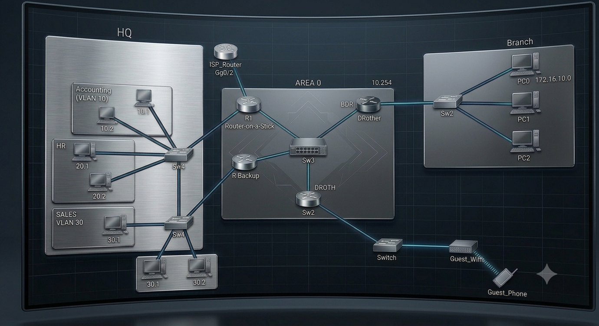

### Projektübersicht
Dieses Projekt konzentriert sich auf die Simulation einer mehrschichtigen Enterprise-Netzwerkarchitektur, die entwickelt wurde, um Unternehmensstandards für Skalierbarkeit, Redundanz und strukturelle Sicherheit zu erfüllen. Es modelliert ein modernes Campus-Netzwerk mit separaten Core-, Distribution- und Access-Schichten, um sicherzustellen, dass logische Grenzen den Best Practices des Engineerings entsprechen.

### Kernarchitektur & Technischer Ansatz

#### 1. Hochverfügbarkeit & Redundanz (HSRP)
Um Single Points of Failure auf der Ebene des Standard-Gateways zu verhindern, wird auf der Distributionsschicht das **Hot Standby Router Protocol (HSRP)** implementiert.
* *Ziel:* Es bietet eine automatisierte Standard-Gateway-Redundanz für kritische VLANs und stellt sicher, dass der Datenverkehr bei Ausfall eines primären Layer-3-Switches oder Routers unterbrechungsfrei weitergeleitet wird.

#### 2. Dynamisches Routing & Skalierbarkeit (OSPF)
Die netzwerkweite Erreichbarkeit wird mittels Single-Area **OSPF (Open Shortest Path First)** konfiguriert.
* *Ziel:* Dieser Ansatz gewährleistet eine schnelle Konvergenz, effiziente Pfadauswahl und vereinfacht zukünftige Netzwerkerweiterungen. OSPF-Metriken und Verbindungskosten sind so optimiert, dass die Bandbreitennutzung über Backbone-Links maximiert wird.

#### 3. Segmentierung & Sicherheit (VLANs & ACLs)
Broadcast-Domänen werden durch lokale **VLANs**, die spezifischen Unternehmensfunktionen (z. B. Management, IT, Operations, Guest) zugeordnet sind, streng begrenzt.
* *Ziel:* Das Inter-VLAN-Routing wird über Zugriffskontrolllisten (ACLs) streng kontrolliert, um ein Berechtigungsmodell nach dem Prinzip der minimalen Rechte (Least-Privilege) durchzusetzen und unbefugten Datenverkehr zu filtern.
#### 4. Perimetersicherheit & Internet Edge (NAT)
Um einen sicheren Internet-Ausgang zu ermöglichen und gleichzeitig öffentliche IP-Adressen zu sparen, wird am Netzwerkrand **Network Address Translation (NAT)** — genauer gesagt Port Address Translation (PAT) — konfiguriert.
* *Ziel:* Es verbirgt interne IP-Strukturen vor dem öffentlichen Internet und übersetzt private Adressen in wiederverwendbare öffentliche Endpunkte, wodurch eine grundlegende Schutzschicht entsteht.

#### 5. Enterprise Mobility & Gastzugang (Wi-Fi)
Die drahtlose Konnektivität ist in das Campus-Design integriert, um den internen Unternehmensdatenverkehr strikt vom Gastdatenverkehr zu trennen.
* *Ziel:* Es wird simuliert, wie drahtlose Endgeräte dynamisch in ihre jeweiligen VLANs geleitet werden, um unbefugten Zugriff auf Kernressourcen zu verhindern.

---

### Technologie-Stack

  Cisco IOS
  OSPF v2
  HSRP
  VLAN Trunking (802.1Q)
  Extended ACLs
  Dynamisches NAT / PAT
  Wireless LAN (WLAN)

