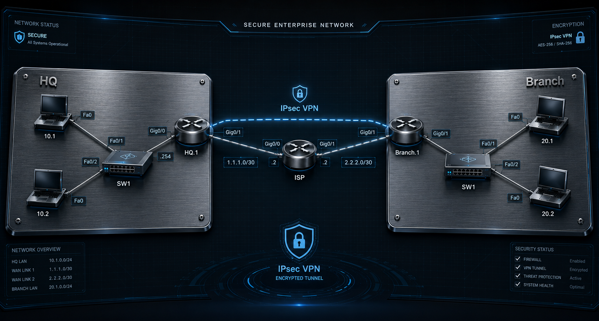

### Projektübersicht

Dieses Projekt demonstriert das Design und die Konfiguration eines sicheren **Site-to-Site IPsec VPN**-Tunnels zwischen zwei Unternehmensnetzwerken (HQ und Branch) über eine ungesicherte öffentliche ISP-Infrastruktur unter Verwendung von Cisco IOS.

Das Ziel dieses Projekts ist es, einen sicheren Kommunikationskanal zwischen zwei geografisch getrennten LANs bereitzustellen. Durch die Implementierung eines IPsec-Tunnels stellen wir sicher, dass der interne Datenverkehr verschlüsselt und für den Internetdienstanbieter (ISP) unsichtbar bleibt.

---

### 🛠️ Technical Stack

* **IPsec (Internet Protocol Security):** Gewährleistet Datenzertifikate, Integrität und Authentifizierung.
* **IKE Phase 1 (ISAKMP):** Handelt Sicherheitsassoziationen aus und etabliert eine sichere Management-Ebene.
* **IKE Phase 2 (IPsec SA):** Definiert, wie die eigentlichen Daten verschlüsselt und übertragen werden.
* **AES-256 & SHA:** Erweiterte Verschlüsselungs- und Hashing-Standards für maximale Sicherheit.
* **Cisco IOS Sicherheitsfunktionen:** Nutzung des `securityk9` Technologiepakets.

---

### 📊 Adressierungstabelle

| Gerät | Schnittstelle | IP-Adresse | Beschreibung |
| :--- | :--- | :--- | :--- |
| **HQ-Router** | Gig0/0 | 1.1.1.1/30 | Public Facing (Internet) |
| **HQ-Router** | Gig0/1 | 192.168.10.1/24 | HQ LAN Gateway |
| **ISP-Router** | Gig0/0 | 1.1.1.2/30 | HQ Service Termination |
| **ISP-Router** | Gig0/1 | 2.2.2.2/30 | Branch Service Termination |
| **BR-Router** | Gig0/0 | 2.2.2.1/30 | Public Facing (Internet) |
| **BR-Router** | Gig0/1 | 192.168.20.1/24 | Branch LAN Gateway |

---

### 🔬 Verifizierung & Proof of Concept

```text
Um nachzuweisen, dass der Tunnel betriebsbereit ist und der Datenverkehr 
verschlüsselt wird, wurden die folgenden Verifizierungsschritte durchgeführt:

========================================================================
1. Phase 1 Zustand (ISAKMP SA)
========================================================================
Der Befehl 'show crypto isakmp sa' bestätigt, dass der Management-Tunnel 
erfolgreich eingerichtet wurde.

HQ# show crypto isakmp sa
IPv4 Crypto ISAKMP SA
dst             src             state          conn-id status
1.1.1.1         2.2.2.1         QM_IDLE           1001 ACTIVE

Erwarteter Zustand: QM_IDLE (Zeigt eine erfolgreiche Sitzung an).


========================================================================
2. Phase 2 Datenfluss (IPsec SA)
========================================================================
Der Befehl 'show crypto ipsec sa' liefert den technischen Beweis für die 
Verschlüsselung. Durch Überwachung der Paketzähler können wir bestätigen, 
dass die Daten durch den sicheren Tunnel fließen.

HQ# show crypto ipsec sa
interface: GigabitEthernet0/0
    Crypto map tag: MYMAP, local addr 1.1.1.1

   protected vrf: (none)
   local  ident (addr/mask/prot/port): (192.168.10.0/255.255.255.0/0/0)
   remote ident (addr/mask/prot/port): (192.168.20.0/255.255.255.0/0/0)
   
   #pkts encaps: 45, #pkts encrypt: 45, #pkts digest: 45
   #pkts decaps: 45, #pkts decrypt: 45, #pkts verify: 45

Wichtige zu überwachende Zähler:
- #pkts encaps: Anzahl der verschlüsselten und gesendeten Pakete.
- #pkts decaps: Anzahl der empfangenen und entschlüsselten Pakete.


========================================================================
3. ICMP-Konnektivitätstest (Ping)
========================================================================
Ein Ping wurde von HQ-PC (192.168.10.x) zu Branch-PC (192.168.20.x) 
gestartet, um die End-to-End-Konnektivität über den sicheren Pfad zu testen.

HQ-PC> ping 192.168.20.10

Pinging 192.168.20.10 with 32 bytes of data:
Reply from 192.168.20.10: bytes=32 time=12ms TTL=126
Reply from 192.168.20.10: bytes=32 time=10ms TTL=126

Ping statistics for 192.168.20.10:
    Packets: Sent = 4, Received = 4, Lost = 0 (0% loss)

Ergebnis: Erfolgreich (0% Verlust nach der anfänglichen Tunnel-Aushandlung).
Verifizierung: Kontinuierliches Pingen führt zu einem Anstieg der in Phase 2 
genannten Kapselungs- und Dekapselungszähler.