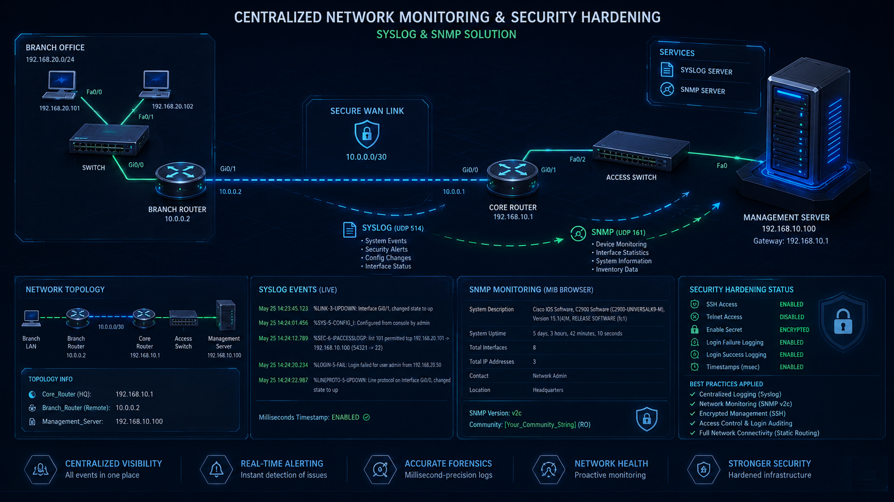

### Projektübersicht

Dieses Projekt zeigt die Implementierung eines zentralisierten Überwachungssystems für eine standortübergreifende (Multi-Site) Netzwerkinfrastruktur mithilfe von **Syslog**- und **SNMP**-Protokollen sowie die Anwendung von Best Practices für die Cybersicherheitshärtung (Hardening) auf Cisco IOS-Geräten.

Das Hauptziel des Projekts besteht darin, die Transparenz (Visibility) innerhalb einer Unternehmensinfrastruktur zu maximieren, alle kritischen Netzwerkereignisse von einem zentralen Punkt aus zu analysieren und die Verwaltungslinien gegen unbefugte Zugriffsversuche abzusichern.

---

### 🛠️ Technische Infrastruktur

* **Syslog:** Leitet alle kritischen Systemereignisse wie Schnittstellenstatus, Konfigurationsänderungen und Sicherheitswarnungen in Echtzeit an einen zentralen Server weiter.
* **SNMP v2c (Simple Network Management Protocol):** Ermöglicht die Fernabfrage von Geräteinventar, Hardwareressourcen und Systembeschreibungen über den MIB-Browser.
* **Präzise Ereigniszeitmessung (Timestamps):** Fügt Protokolleinträgen im Falle eines Cybervorfalls Zeitstempel mit Millisekundenpräzision hinzu, um eine fehlerfreie forensische Analyse zu gewährleisten.
* **Sicherheitshärtung (Hardening):** Eine Sicherheitsstufe, die implementiert wurde, um unbefugte Zugriffsversuche zu verhindern und Brute-Force-Angriffe auf Infrastrukturgeräte zu erkennen.

---

### 📊 Adressierungs- und Topologietabelle

| Gerät | Schnittstelle | IP-Adresse | Beschreibung |
| :--- | :--- | :--- | :--- |
| **Core_Router** | Gig0/0 | 192.168.10.1/24 | Hauptsitz-Gateway (HQ) |
| **Branch_Router** | Gig0/0 | 10.0.0.2/30 | Schnittstelle für Außenstelle |
| **Management_Server** | Fast0/1 | 192.168.10.100/24 | Syslog- & SNMP-Diensteserver |

---

### 🔬 Verifizierung und Konzeptnachweis

Nachfolgend sind die Konfigurationsausgaben und Testschritte aufgeführt, mit denen nachgewiesen wird, dass die Systeme stabil laufen und die Sicherheitsrichtlinien aktiv sind:

---
1. Zentralisierte Protokollierung und präzise Zeitstempelkonfiguration

Cisco IOS-Befehle, mit denen Protokolldaten von Netzwerkgeräten an den zentralen Server weitergeleitet und die Zeitanalyse überprüft werden:

```text
Core_Router# configure terminal
Core_Router(config)# logging 192.168.10.100
Core_Router(config)# service timestamps log datetime msec
Core_Router(config)# line console 0
Core_Router(config-line)# logging synchronous
```
Erwarteter Status: Wenn eine Schnittstelle heruntergefahren wird (shutdown), sollte die Protokollmeldung mit Millisekunden-Zeitstempel (msec) sofort auf dem Syslog-Bildschirm des Servers erscheinen.

2. SNMP v2c Abfrage- und Zugriffskonfiguration

Bereitstellung von Geräteinformationen für den Überwachungsserver als schreibgeschützt (Read-Only) und Definition von Unternehmensmetadaten:
```text
Core_Router(config)# snmp-server community GuvenliToplulukSifresi RO
Core_Router(config)# snmp-server contact Algan Ayzit
Core_Router(config)# snmp-server location Merkez Veri Merkezi
```
Verifizierung: Wenn das Tool 'MIB Browser' auf dem Management_Server ausgeführt und das 'GuvenliToplulukSifresi' eingegeben wird, wird das Geräteinventar erfolgreich abgerufen.

3. Sicherheitshärtung der Gerätelinie (Hardening)

Deaktivieren des unsicheren Telnet-Protokolls, Aktivieren von SSH v2 und Protokollieren von Anmeldeversuchen zur Überwachung von Brute-Force-Angriffen:
```text
Core_Router(config)# hostname Core_Router
Core_Router(config)# ip domain-name alganayzit.local
Core_Router(config)# crypto key generate rsa (Modulus: 1024)
Core_Router(config)# ip ssh version 2

Core_Router(config)# line vty 0 4
Core_Router(config-line)# transport input ssh
Core_Router(config-line)# login local
Core_Router(config-line)# exit

Core_Router(config)# login on-failure log
Core_Router(config)# login on-success log
Core_Router(config)# enable secret EncriptedSecretPassword123
```
Ergebniskontrolle: Bei einem fehlerhaften SSH-Anmeldeversuch am Gerät wird sofort eine Authentifizierungsfehlermeldung (LOGIN-4-AUTH_FAIL) auf dem Syslog-Bildschirm generiert.



Projekt-Repository anzeigen (GitHub)
